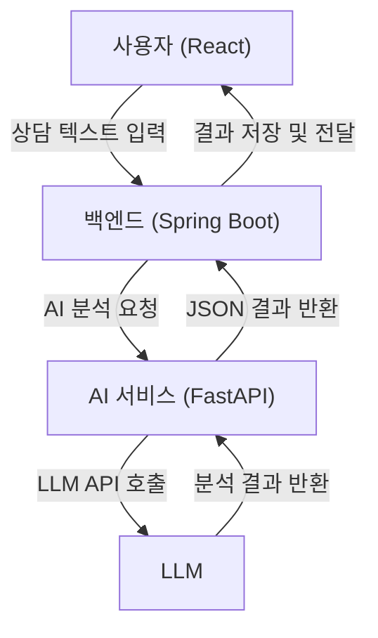

## 🚀 새로운 도전의 시작: AI 상담 분석 시스템

오랫동안 마음속에 품고 있던 새로운 사이드 프로젝트, **AI 기반 상담 내용 분석 및 관리 시스템** 개발을 시작했다. 앞으로 블로그에 사이드 프로젝트 과정을 기록하려한다.

이 프로젝트의 목표는 고객 상담 내용을 AI로 분석하여 상담의 질을 높이고, 관리 업무의 효율을 극대화하는 서비스를 만드는 것이다.

그동안 항상 대고객전용 서비스 개발에 집중해왔기에, 이번에는 **내부 관리 업무에 초점**을 맞춘 프로젝트를 통해 새로운 도전을 해보려 한다. (그 과정에서 AI 튜닝 능력도 키우고! 😉)

---

## 🎯 프로젝트 목표와 핵심 기능

고객과의 소통이 그 어느 때보다 중요해진 지금, 상담 내용은 단순한 텍스트가 아닌, 비즈니스의 성패를 가르는 중요한 데이터이다. 우리는 이 데이터를 AI 기술로 분석해 **마케팅 및 리스크 관리**에 도움이 될 서비스를 만드려한다.

*   **상담 내용 요약**: 방대한 상담 내용을 핵심만 간추려 한눈에 파악할 수 있게 한다.
*   **핵심 키워드 태깅**: "카드 발급", "대출 문의" 같은 주요 이슈를 자동으로 태깅하여 데이터 기반의 의사결정을 돕는다.
*   **감정 분석**: 고객의 미묘한 감정 변화를 감지하여 한발 앞선 대응을 가능하게 한다.
*   **리스크 예측**: 민원 발생 가능성이나 고객 이탈 징후 같은 잠재적 리스크를 미리 식별한다.
*   **민감 정보 보호**: 개인정보와 같은 민감한 내용은 안전하게 마스킹하고 암호화하여 관리한다.

---

## 🛠️ 기술 스택과 아키텍처

이번 프로젝트는 각 기능의 독립성과 확장성을 높이기 위해 **마이크로서비스 아키텍처(MSA)** 를 채택했다.

*   **프론트엔드**: `React`와 `TypeScript`를 사용해 직관적이고 반응성 높은 사용자 경험을 만든다.
*   **백엔드**: `Java 17`과 `Spring Boot 3.x` 기반으로 견고한 API 서버를 구축한다.
*   **AI 서비스**: `Python`과 `FastAPI`를 활용하여 외부 LLM API와 연동되는 가볍고 빠른 AI 분석 서비스를 개발한다.

전체적인 데이터 처리 흐름은 아래와 같다.

---

## 👥 팀 구성

- 프론트엔드 엔지니어
- 백엔드 엔지니어
- AI 엔지니어
- 김현우: https://github.com/HxWOO (나, AI 엔지니어)

---

## 앞으로의 계획

팀의 AI엔지니어로서 개발은 `FastAPI`를 이용한 LLM 요약 서비스부터 시작한다. 개발 과정에서 마주하는 어려움, 해결 과정, 그리고 새롭게 배우는 점들을 꾸준히 블로그에 기록하고 공유하려 한다.

새로운 도전이 성공적으로 마무리되길 바란다! 🙏
