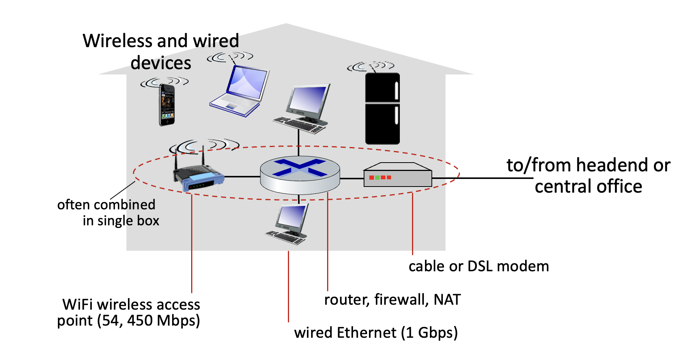
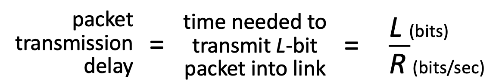
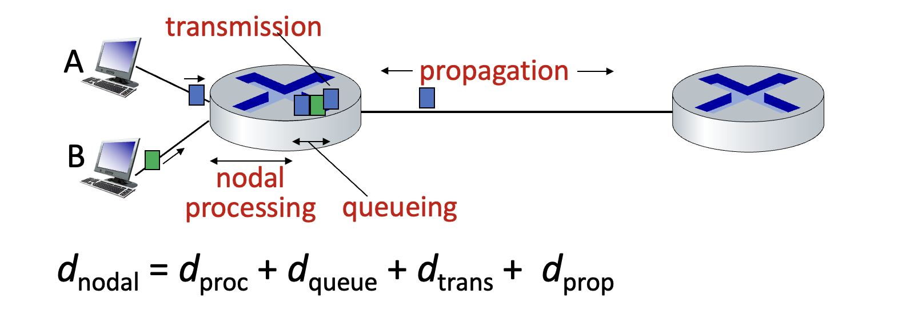
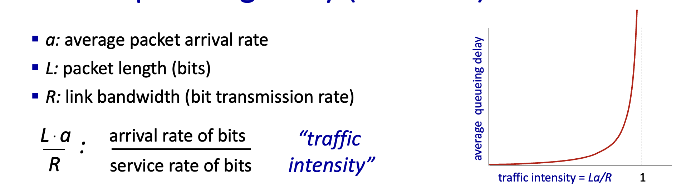
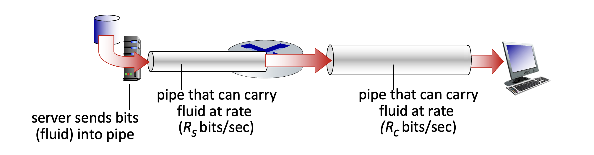

# 📡 인터넷, 어떻게 이루어져 있을까?

인터넷은 수천억 개의 컴퓨팅 디바이스들이 연결된 거대한 네트워크이다. 우리가 흔히 사용하는 컴퓨터나 스마트폰 같은 **호스트(host)** 또는 **엔드 시스템(end-system)** 들이 인터넷의 가장자리에 위치하며 네트워크 앱을 실행한다.

이러한 장치들 사이에서 데이터는 **패킷(packet)** 이라는 작은 단위로 나뉘어 전송되는데, 이 패킷들을 목적지까지 전달하는 역할을 하는 것이 바로 **패킷 스위치(packet switch)**, 즉 라우터나 스위치 같은 장비들이다.

그리고 이 모든 것들은 구리선, 광섬유, 라디오파 등 다양한 **통신 링크(communication link)** 를 통해 물리적으로 연결되어 있다. 이 링크의 데이터 전송률을 **대역폭(bandwidth)** 이라고 부른다.

결국 인터넷이란, 수많은 네트워크들이 모여 만들어진 '네트워크의 네트워크'라고 할 수 있다.

## 1. 인터넷의 구조: Edge, Access, Core

인터넷의 구조는 크게 세 부분으로 나눌 수 있다.

- **네트워크 엣지(Network Edge):** 클라이언트와 서버 역할을 하는 호스트들이 여기에 속한다. 서버는 보통 대규모의 데이터 센터에 모여있다.
- **액세스 네트워크(Access Network)와 물리 매체(Physical Media):** 유무선 통신 링크를 통해 엣지를 네트워크 코어에 연결한다. 집에서 사용하는 DSL이나 케이블 모뎀, 회사의 이더넷, 그리고 스마트폰의 4G/5G 망 등이 모두 액세스 네트워크에 해당한다.
- **네트워크 코어(Network Core):** 서로 연결된 라우터들의 집합으로, 네트워크의 네트워크를 구성하는 핵심이다.

집에서는 보통 케이블이나 DSL 모뎀을 통해 인터넷 신호를 받아와 라우터로 와이파이를 구성해서 사용한다. 공유기를 통해 여러 디바이스가 인터넷에 접속하는 익숙한 모습이다.

기업 환경에서는 이더넷(유선)과 와이파이(무선)를 함께 사용하여 수많은 장치들을 스위치와 라우터에 연결한다. 규모가 클수록 유선 연결이 경제적이고 안정적이라, 보통 2개 이상의 인터넷 회선을 유지하며 리스크를 관리한다고 한다.

데이터 센터는 정말 어마어마한 곳인데, 수백에서 수천 개의 서버들이 초고속 링크로 서로 연결되고, 또 인터넷과 연결되어 있다.

### 호스트는 어떻게 데이터를 보낼까?

호스트는 애플리케이션 메시지를 **패킷(packet)** 이라는 작은 단위로 나누어 네트워크로 전송한다. 길이 L 비트의 패킷을 R bps(bits per second)의 전송률(transmission rate)로 링크에 밀어넣는다고 생각하면 된다.

여기서 패킷 전송 시간(packet transmission delay)은 L/R 초가 된다.

중요한 점은, 이 시간은 단순히 내 컴퓨터에서 패킷을 네트워크로 내보내는 데 걸리는 시간일 뿐, 패킷이 목적지까지 도착하는 시간은 아니라는 것이다. 아직 갈 길이 멀다... 😥

## 2. 물리 매체: 데이터가 지나가는 길

비트(bit)는 송신기와 수신기 사이에서 물리적인 매체를 통해 전달된다.

물리 매체는 크게 두 종류로 나뉜다.

- **유도 매체(Guided Media):** 신호가 케이블을 따라 명확한 경로로 전달된다. 구리선, 광섬유 케이블, 동축 케이블 등이 여기에 속한다. 특히 두 개의 구리선을 꼬아 만든 **Twisted Pair(TP)** 케이블은 이더넷(Ethernet) 통신에 널리 사용된다. 보통 CAT.6 이상의 규격을 사용한다.
- **비유도 매체(Unguided Media):** 신호가 공간으로 자유롭게 퍼져나간다. 라디오파, 위성 통신, 와이파이, 셀룰러 데이터 등이 해당된다. 외부 간섭에 취약하다는 단점이 있다.

## 3. 네트워크 코어: 패킷 스위칭의 세계

네트워크 코어는 서로 연결된 라우터들로 이루어진 복잡한 그물망이다. 여기서는 **패킷 스위칭(Packet Switching)** 이라는 방식으로 데이터가 전송된다.

호스트가 보낸 패킷들은 네트워크 코어의 라우터들을 거치며 목적지까지 전달된다. 이 과정에서 네트워크 코어는 두 가지 중요한 기능을 수행한다.

- **포워딩(Forwarding) 또는 스위칭(Switching):** 라우터에 들어온 패킷을 어떤 출력 링크로 내보낼지 결정하는 **지역적인(local)** 동작이다.
- **라우팅(Routing):** 패킷이 출발지에서 목적지까지 가는 전체 **경로를 결정**하는 **전역적인(global)** 동작이다. 라우팅 알고리즘이 이 역할을 담당한다.

### 저장 후 전달 (Store-and-Forward)

패킷 스위칭은 **저장 후 전달(Store-and-Forward)** 방식으로 동작한다. 라우터는 패킷 전체를 수신해야만 다음 라우터로 전달을 시작할 수 있다. 이 때문에 각 라우터를 거칠 때마다 전송 지연(transmission delay)이 발생한다.

만약 특정 링크로 나가려는 패킷의 양이 링크의 처리 용량을 초과하면 **큐잉(Queueing)** 이 발생한다. 패킷들은 라우터의 버퍼(큐)에서 자기 차례를 기다리게 되고, 이 버퍼마저 가득 차면 새로 도착하는 패킷은 **손실(loss)** 된다. 😭

### 회선 스위칭 vs 패킷 스위칭

패킷 스위칭의 대안으로 **회선 스위칭(Circuit Switching)** 이 있다. 이는 데이터를 보내기 전에 출발지와 목적지 사이에 전용 회선을 미리 할당하는 방식이다. 마치 전화 통화처럼 말이다.

회선 스위칭은 연결된 동안에는 자원을 독점하므로 통화 품질이 보장되고 지연도 거의 없다는 장점이 있다. 하지만 데이터를 보내지 않는 시간에도 회선이 계속 점유되므로 자원 낭비가 심하다.

회선을 나누는 방식에는 주파수 대역을 나누는 **FDM(Frequency Division Multiplexing)** 과, 시간을 나누는 **TDM(Time Division Multiplexing)** 이 있다.

결론적으로, 패킷 스위칭은 약간의 지연이나 손실 위험을 감수하는 대신, 네트워크 자원을 훨씬 효율적으로 사용할 수 있어 오늘날 인터넷의 표준 방식으로 자리 잡았다.

## 4. 네트워크의 네트워크

우리는 **인터넷 서비스 제공자(ISP, Internet Service Provider)** 를 통해 인터넷에 접속한다. SKT, KT, LG U+ 같은 통신사들이 바로 ISP이다.

전 세계의 모든 호스트들이 서로 통신하려면 이 ISP들이 서로 연결되어 있어야 한다. 어떻게 이 수많은 ISP들을 연결할까?

소수의 거대한 **글로벌 ISP(Global ISP)** 들이 있고, 이들이 서로 연결하여 인터넷의 등뼈를 이룬다. 그리고 지역 ISP(Regional ISP)들이 이 글로벌 ISP에 연결되고, 또 작은 ISP들이 지역 ISP에 연결되는 계층적인 구조를 가진다.

최근에는 구글, 넷플릭스 같은 거대 콘텐츠 제공자들이 자체적인 **콘텐츠 제공자 네트워크(CPN, Content Provider Network)** 를 구축하여 사용자에게 더 빠르고 안정적으로 콘텐츠를 전송하기도 한다. ISP 망을 거치지 않고 자신들의 데이터 센터에서 사용자에게 직접 콘텐츠를 쏴주는 것이다.

## 5. 패킷 지연과 손실의 원인

네트워크에서 패킷 지연(delay)과 손실(loss)은 왜 발생할까? 바로 라우터의 큐에서 패킷들이 전송을 기다리다가, 그 대기열(큐)이 꽉 차버리면 그 이후에 도착하는 패킷들은 버려지기 때문이다.

패킷 지연의 원인은 크게 4가지로 나눌 수 있다.

1.  **처리 지연 (Processing Delay):** 라우터가 패킷 헤더를 분석하고, 비트 오류를 검사하고, 출력 링크를 결정하는 데 걸리는 시간이다. 보통 마이크로초(μs) 단위로 매우 짧다.
2.  **큐잉 지연 (Queueing Delay):** 패킷이 출력 링크로 전송되기 위해 큐에서 대기하는 시간이다. 네트워크 혼잡도에 따라 크게 달라지며, 지연의 주범이다.
3.  **전송 지연 (Transmission Delay):** 앞에서 봤던 L/R, 즉 패킷 전체를 링크로 밀어내는 데 걸리는 시간이다.
4.  **전파 지연 (Propagation Delay):** 비트가 링크를 통해 물리적으로 전파되는 데 걸리는 시간이다. 링크의 길이(d)를 전파 속도(s)로 나눈 값(d/s)이다.

### 큐잉 지연 들여다보기

큐잉 지연은 트래픽 강도(Traffic Intensity), 즉 `La/R` 값에 따라 극적으로 변한다. (L: 패킷 크기, a: 패킷 도착률, R: 링크 전송률)

- `La/R`이 0에 가까우면: 큐잉 지연은 거의 없다. 한산한 도로! 🚗
- `La/R`이 1에 가까워지면: 큐잉 지연이 급격히 증가한다. 퇴근길 정체 시작! 꽉 막힌다. 🚕
- `La/R`이 1보다 크면: 패킷 도착량이 처리량을 초과하므로, 큐는 무한정 길어지고 지연 시간도 무한대에 가까워진다. 사실상 서비스 불능 상태다. 헬게이트 오픈! 🌋

### `traceroute`로 지연 측정하기

`traceroute`라는 프로그램을 사용하면 출발지부터 목적지까지 가는 경로의 각 라우터까지의 지연 시간을 측정할 수 있다. 일부러 오류(ICMP)를 발생시키고, 라우터가 보내는 오류 메시지를 받아 시간을 측정하는 원리다.

측정값이 갑자기 크게 늘어난다면, 그 구간에서 병목 현상이 발생했거나 물리적인 거리가 멀어졌다고 의심해볼 수 있다. 가끔 지연이 줄어드는 것처럼 보일 때도 있는데, 측정에 사용되는 패킷들이 서로 다른 경로로 갔을 수 있기 때문이다.

### Wireshark

`Wireshark`라는 툴은 `pcap` 라이브러리를 이용해 만든 패킷 분석기로, 네트워크를 오가는 패킷을 직접 눈으로 볼 수 있게 해준다. 패킷의 구조를 자세히 뜯어보며 실습하기 아주 좋은 도구이다! 👀

### 처리율 (Throughput)

처리율은 송신자와 수신자 사이에 실제로 데이터가 전송되는 속도(bits/time)를 의미한다.

- **순간 처리율(Instantaneous Throughput):** 특정 시점의 전송 속도.
- **평균 처리율(Average Throughput):** 긴 시간 동안의 평균 전송 속도.

네트워크 경로상에 여러 링크가 있을 때, 전체 처리율은 가장 속도가 느린 링크, 즉 **병목 링크(bottleneck link)** 에 의해 결정된다. 파이프가 아무리 넓어도 중간에 좁은 구간이 있으면 물이 그만큼만 흐르는 것과 같은 이치다.

## 6. 네트워크 보안: 태생적 한계와 방어

인터넷은 초기에 소수의 신뢰할 수 있는 사용자들만 사용했기 때문에, 보안을 거의 고려하지 않고 설계되었다. 😱 그래서 오늘날에는 다양한 보안 위협에 노출되어 있으며, 프로토콜 수준에서 이를 보완해야 한다.

### 주요 공격 유형

- **패킷 가로채기(Packet Interception):** 네트워크 인터페이스를 통해 지나가는 패킷을 몰래 엿보고 기록하는 공격이다. 비밀번호 같은 민감한 정보가 그대로 노출될 수 있다.
- **가짜 신원(Fake Identity):** IP 주소를 속여 다른 사람인 척 위장하고 악의적인 패킷을 보낸다.
- **서비스 거부 공격(Denial of Service, DoS):** 엄청난 양의 가짜 트래픽을 발생시켜 서버가 정상적인 요청을 처리할 수 없게 만드는 공격이다.

### 방어 방법

이러한 공격에 대응하기 위해 여러 방어 기술이 사용된다.

- **인증(Authentication):** 사용자가 누구인지 확인하는 절차. (e.g., SIM 카드, 로그인)
- **기밀성(Confidentiality):** 데이터를 암호화하여 허가된 사용자만 볼 수 있게 한다.
- **무결성 검사(Integrity Check):** 데이터가 전송 중에 변조되지 않았는지 디지털 서명 등으로 확인한다.
- **접근 제한(Access Restriction):** 비밀번호로 보호된 VPN 등을 사용하여 허가된 사용자만 네트워크에 접근하게 한다.
- **방화벽(Firewalls):** 네트워크의 관문에서 악의적인 트래픽을 필터링한다.

## 7. 계층 구조: 복잡한 네트워크를 이해하는 방법

네트워크는 매우 복잡하기 때문에, 이를 쉽게 이해하고 관리하기 위해 **계층(Layer)** 구조를 사용한다. 각 계층은 특정 서비스를 수행하며, 하위 계층의 서비스를 이용하여 상위 계층에 서비스를 제공한다.

이렇게 계층으로 나누면, 각 부분의 역할을 명확히 할 수 있고, 시스템을 모듈화하여 유지보수와 업그레이드가 쉬워진다는 장점이 있다.

### 인터넷 프로토콜 스택 (5계층)

인터넷은 보통 5개의 계층으로 설명한다.

- **애플리케이션 계층(Application Layer):** 네트워크 애플리케이션을 지원한다. (HTTP, SMTP, DNS 등)
- **전송 계층(Transport Layer):** 프로세스 간의 데이터 전송을 담당한다. (TCP, UDP)
- **네트워크 계층(Network Layer):** 데이터그램(datagram)을 출발지에서 목적지까지 라우팅한다. (IP)
- **링크 계층(Link Layer):** 이웃한 네트워크 노드 간의 데이터 전송을 담당한다. (이더넷, 와이파이)
- **물리 계층(Physical Layer):** 실제 비트(0과 1)를 전기 신호나 빛으로 바꿔 전송한다.

데이터는 각 계층을 내려가면서 헤더 정보가 추가되는 **캡슐화(Encapsulation)** 과정을 거친다. (메시지 → 세그먼트 → 데이터그램 → 프레임) 수신 측에서는 이 과정을 역순으로 거쳐 원본 데이터를 얻는다.

스위치는 2계층(링크 계층)까지, 라우터는 3계층(네트워크 계층)까지 동작하는 장비이다.
