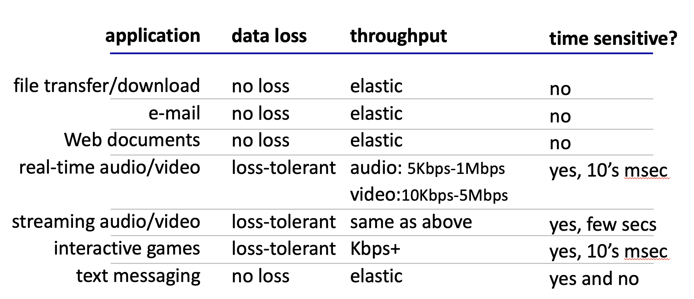

# 🧑‍💻 네트워크 앱은 어떻게 만들어질까?

네트워크 애플리케이션은 서로 다른 **엔드 시스템(end-system)** 에서 실행되며 네트워크를 통해 통신한다. 여기서 중요한 점은, 네트워크 코어(라우터 등)는 앱을 실행하지 않으므로, 우리는 오직 엔드 시스템에서 동작하는 앱만 만들면 된다는 것이다.

## 1. 앱 아키텍처: Client-Server vs P2P

네트워크 앱의 구조는 크게 두 가지로 나뉜다.

-   **클라이언트-서버(Client-Server) 패러다임:**
    -   **서버:** 항상 켜져 있고, 고정된 IP 주소를 가지며, 보통 거대한 데이터 센터에 모여있다.
    -   **클라이언트:** 서버와 통신하며, 필요할 때만 간헐적으로 연결된다. IP 주소도 동적으로 바뀔 수 있다. 클라이언트끼리는 직접 통신하지 않는다.
-   **P2P(Peer-to-Peer) 구조:**
    -   항상 서버를 거치지 않고, 시스템(피어)들이 서로 직접 통신한다.
    -   각 피어는 클라이언트인 동시에 서버가 될 수 있으며, 간헐적으로 연결되고 IP도 동적으로 변한다. (e.g., 파일 공유 프로그램)

## 2. 프로세스는 어떻게 통신할까? 🤔

프로세스는 호스트에서 실행되는 프로그램을 말한다. 같은 호스트 내의 프로세스들은 **inter-process communication**으로 소통하지만, 다른 호스트에 있는 프로세스들은 **메시지(message)** 를 주고받으며 통신한다.

-   **클라이언트 프로세스:** 통신을 시작하는 쪽.
-   **서버 프로세스:** 연결을 기다리는 쪽.

### 소켓 (Socket) 🚪

프로세스는 **소켓(socket)** 이라는 창구를 통해 메시지를 주고받는다. 소켓은 운영체제가 관리하는 일종의 출입문 같은 것이다. 통신하는 양쪽 프로세스는 각각 자신만의 소켓을 가지게 된다.

### 프로세스 주소 지정

메시지를 받으려면 각 프로세스는 고유한 **식별자(identifier)** 가 필요하다. 호스트는 32비트 **IP 주소**로 식별되고, 프로세스는 그 호스트 내에서 **포트 번호(port number)** 로 식별된다. 즉, `IP 주소 + 포트 번호`가 프로세스의 최종 주소가 되는 셈이다.

## 3. 애플리케이션 계층 프로토콜

서로 다른 시스템의 앱이 통신하려면 공통된 약속, 즉 **프로토콜(protocol)** 이 필요하다. 애플리케이션 계층 프로토콜은 다음을 정의한다.

-   **메시지 타입:** 어떤 종류의 메시지를 교환할지 (e.g., 요청(request), 응답(response))
-   **메시지 문법:** 메시지의 필드 구조와 순서.
-   **메시지 의미:** 각 필드에 담긴 정보의 뜻.
-   **규칙:** 언제, 어떻게 메시지를 주고받을지에 대한 절차.

HTTP, SMTP 같은 표준 프로토콜들은 **RFC(Request for Comments)** 문서에 공개되어 있어 누구나 보고 구현할 수 있다.

### 앱이 전송 계층에 바라는 것들

애플리케이션은 필요에 따라 전송 계층에 다음과 같은 서비스를 요구한다.

-   **데이터 무결성(Data Integrity):** 100% 신뢰성 있는 데이터 전송이 필요한 앱도 있고, 약간의 손실은 괜찮은 앱도 있다.
-   **타이밍(Timing):** 실시간 통화처럼 지연이 거의 없어야 하는 앱도 있다.
-   **처리율(Throughput):** 비디오 스트리밍처럼 최소한의 대역폭이 보장되어야 효율적인 앱도 있다.
-   **보안(Security):** 암호화나 데이터 무결성 보장이 필요한 경우.

## 4. 인터넷 전송 프로토콜: TCP vs UDP

인터넷은 두 가지 핵심 전송 프로토콜을 제공한다.

### TCP (Transmission Control Protocol)

-   **신뢰성 있는 전송(reliable transport):** 데이터가 순서대로, 손실 없이 전달되는 것을 보장한다.
-   **흐름 제어(flow control):** 송신자가 수신자를 데이터로 압도하지 않도록 속도를 조절한다.
-   **혼잡 제어(congestion control):** 네트워크가 혼잡할 때 전송 속도를 줄여 헬게이트가 열리는 것을 막는다. 🌋
-   **연결 지향(connection-oriented):** 데이터를 보내기 전에 클라이언트와 서버 간에 논리적인 연결을 설정해야 한다.
-   하지만, 최소 처리율이나 타이밍, 보안은 기본적으로 제공하지 않는다.

### UDP (User Datagram Protocol)

-   **신뢰성 없는 데이터 전송(unreliable data transfer):** 그냥 보낸다. 잘 갔는지, 순서는 맞는지 신경 쓰지 않는다.
-   신뢰성, 흐름 제어, 혼잡 제어, 타이밍, 보안, 연결 설정 등 아무것도 보장하지 않는다! 😱

그럼 UDP는 왜 쓸까? 데이터 손실에 비교적 관대하고(loss tolerant), 빠른 전송이 더 중요한 실시간 스트리밍이나 온라인 게임 등에서 사용된다.

### TCP에 보안 더하기: TLS

기본 TCP와 UDP는 암호화 기능이 없어 모든 데이터(심지어 비밀번호까지!)가 그대로 노출된다. 이를 보완하기 위해 **TLS(Transport Layer Security)** 를 사용한다. TLS는 TCP 위에서 동작하며, 다음과 같은 기능을 제공한다.

-   **암호화된 TCP 연결**
-   **데이터 무결성 보장**
-   **종단점 인증(end-point authentication)**

## 5. HTTP: 웹의 언어

**HTTP(HyperText Transfer Protocol)** 는 웹의 애플리케이션 계층 프로토콜이다.

-   **클라이언트(브라우저):** 서버에 웹 객체(HTML, 이미지 등)를 요청하고 받아와서 화면에 표시한다.
-   **서버:** 클라이언트의 요청에 응답하여 객체를 보내준다.

HTTP는 **TCP**를 사용하며, **Stateless** 하다는 중요한 특징이 있다. 즉, 서버는 클라이언트의 과거 요청을 기억하지 않는다. (기억하면 서버가 너무 복잡해진다.)

### HTTP 연결 방식: Non-persistent vs Persistent

-   **Non-persistent HTTP (HTTP/1.0):**
    -   하나의 TCP 연결로 **하나의 객체**만 전송한다.
    -   HTML 파일 안에 이미지 10개가 있다면, 총 11번의 TCP 연결이 필요하다. (HTML 1번 + 이미지 10번)
    -   매번 연결을 맺고 끊느라 오버헤드가 크다.
    -   응답 시간 = 2 * RTT + 파일 전송 시간 (RTT: 패킷 왕복 시간)

    
    

-   **Persistent HTTP (HTTP/1.1 기본):**
    -   하나의 TCP 연결로 **여러 객체**를 전송할 수 있다.
    -   서버는 응답을 보낸 후에도 연결을 바로 끊지 않고 유지한다.
    -   모든 요청에 대해 RTT가 한 번만 필요하므로 훨씬 효율적이다! 🎉

### HTTP 메시지 형식

HTTP 메시지는 요청(request)과 응답(response) 메시지로 나뉜다.

-   **POST:** 사용자가 입력한 데이터를 메시지의 `entity body`에 담아 서버로 보낸다. (e.g., 로그인, 회원가입)
-   **GET:** 데이터를 URL의 `?` 뒤에 붙여서 보낸다. (e.g., 검색)
-   **HEAD:** GET과 동일하지만, 실제 객체는 빼고 헤더 정보만 요청한다.
-   **PUT:** 서버에 파일을 업로드(또는 교체)한다.

### HTTP 응답 상태 코드

-   `200 OK`: 성공! 🎉
-   `301 Moved Permanently`: 요청한 리소스가 영구적으로 이동했다.
-   `400 Bad Request`: 서버가 요청을 이해할 수 없다. (문법 오류 등)
-   `404 Not Found`: 요청한 문서를 찾을 수 없다. (가장 유명한 에러...😭)
-   `505 HTTP Version Not Supported`: 서버가 해당 HTTP 버전을 지원하지 않는다.

## 6. 상태를 기억하는 방법, 쿠키 🍪

Stateless한 HTTP에서 어떻게 서버는 나를 기억하고 로그인 상태를 유지해줄까? 바로 **쿠키(Cookie)** 덕분이다.

**쿠키의 4가지 요소:**

1.  서버가 응답 헤더에 쿠키 정보를 담아 보낸다.
2.  브라우저는 이 쿠키를 호스트에 저장하고, 다음 요청부터 헤더에 쿠키를 담아 보낸다.
3.  사용자 호스트(브라우저)에 저장된 쿠키 파일.
4.  웹사이트의 백엔드 데이터베이스에 저장된 사용자 정보.

**쿠키 동작 방식:**

1.  최초 요청 시, 서버는 사용자를 위한 고유 ID를 생성하여 쿠키에 담아 응답한다. (백엔드 DB에도 이 ID를 저장)
2.  브라우저는 이 쿠키를 저장한다.
3.  이후 같은 사이트에 요청을 보낼 때마다, 브라우저는 저장된 쿠키를 함께 보낸다.
4.  서버는 쿠키의 ID를 보고 DB와 대조하여 사용자를 식별한다. "아, 이 사람이구나!"

쿠키는 **인증(authorization)**, **장바구니**, **추천**, **세션 상태 유지** 등 다양한 곳에서 사용된다. 하지만 쿠키는 사용자의 브라우징 행동을 추적하는 데 사용될 수 있어 프라이버시 문제가 제기되기도 한다. (특히 여러 사이트를 넘나들며 추적하는 `third-party cookie`)

## 7. 웹 캐시 (프록시 서버)

**웹 캐시(Web Cache)** 또는 **프록시 서버(Proxy Server)** 는 원래 서버(origin server)를 대신하여 클라이언트의 요청에 응답해주는 서버다.

-   브라우저의 모든 HTTP 요청은 먼저 웹 캐시로 간다.
-   만약 요청한 객체가 캐시에 있다면, 캐시가 바로 응답한다. (Cache Hit! ⚡️)
-   없다면, 캐시가 원래 서버에 요청해서 객체를 받아온 후, 클라이언트에게 전달하고 자신도 하나 복사해둔다. (Cache Miss)

**웹 캐시의 장점:**

-   클라이언트의 응답 시간을 단축시킨다.
-   기관(회사, 학교 등) 네트워크의 트래픽을 줄여준다.
-   인터넷은 수많은 캐시들로 촘촘하게 연결되어 있다.

## 8. HTTP/2와 HTTP/3

### HTTP/2

-   **목표:** 여러 객체를 요청할 때 발생하는 지연을 줄이는 것.
-   **문제점 (HTTP/1.1):** 하나의 TCP 연결에서 요청-응답은 순서대로 처리된다(FCFS). 그래서 큰 이미지 하나 때문에 뒤에 있는 작은 파일들이 모두 기다려야 하는 **HOL(Head-of-Line) Blocking** 문제가 발생한다.
-   **해결책 (HTTP/2):**
    -   하나의 객체를 여러 개의 **프레임(frame)** 으로 쪼개고, 이 프레임들을 뒤섞어(interleaving) 전송한다.
    -   이를 통해 HOL Blocking 문제를 해결하고, 리소스 간 우선순위를 둘 수도 있다.
    -   서버가 요청하지 않은 리소스를 미리 보내주는 **서버 푸시(Server Push)** 기능도 있다.

### HTTP/3

-   TCP 대신 **UDP** 위에서 동작한다! (정확히는 QUIC 프로토콜)
-   TCP가 가진 HOL Blocking 문제를 근본적으로 해결하고, 연결 설정 시간을 단축하는 등 더 빠른 웹을 목표로 한다. 아직은 계속 발전 중인 기술이다.
