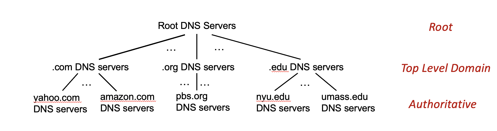

# 3강 DNS, CDN, 그리고 소켓 프로그래밍  SOCKET PROGRAMMING 📡

## DNS (Domain Name Server)

우리가 매일 쓰는 `google.com` 같은 주소는 사실 컴퓨터가 알아들을 수 있는 IP 주소로 변환되어야 한다. 이 역할을 하는 것이 바로 **DNS(Domain Name Server)** 다.

DNS는 여러 개의 네임 서버로 데이터베이스가 분리되어 있고, 계층 구조를 따른다. 왜 단일 서버를 쓰지 않을까? 단일화하면 트래픽, 유지보수, 확장성 등에서 큰 문제가 발생하기 때문이다.

예를 들어 `amazon.com`에 접속하려면, 내 컴퓨터는 먼저 **Root 서버**에 물어보고, Root 서버는 `.com` 서버 주소를 알려준다. 그럼 `.com` 서버에 물어봐서 `amazon.com` 서버의 주소를 최종적으로 알아내는 식이다.

-   **Root Name Server**: 전 세계에 13곳(미러 서버는 더 많음)밖에 없는 정말 중요한 서버다. ICANN이라는 국제기구에서 관리한다.
-   **Top-Level Domain (TLD) Server**: `.com`, `.org`, `.net`이나 국가 도메인(`.kr`) 등을 관리한다.
-   **Authoritative DNS Server**: 각 기관(회사, 대학 등)이 직접 소유하고 관리하는 서버다. `google.com`의 IP 주소는 구글의 Authoritative 서버가 알고 있다.
-   **Local DNS Server**: 우리가 인터넷 서비스 제공자(ISP)로부터 할당받는 DNS 서버다. 캐시 기능이 있어서 한 번 찾은 주소는 기억해두고 빠르게 응답해준다. (가끔 오래된 정보일 때도 있지만...😅)

### DNS Name Resolution

-   **반복적 쿼리(Iterative Query)**: Local DNS 서버가 각 계층의 서버들에게 직접 물어보는 방식이다. "나 모르니까 쟤한테 물어봐"의 연속!
-   **재귀적 쿼리(Recursive Query)**: Local DNS 서버가 Root 서버에게 "네가 알아서 다 찾아줘"라고 요청하는 방식이다. 위로 갈수록 부담이 커진다.

### DNS 정보와 보안

DNS는 **Resource Record(RR)** 라는 형식으로 정보를 저장한다. `(name, value, type, ttl)` 구조인데, `type`에 따라 의미가 달라진다.

-   `A`: `name` = 호스트 이름, `value` = IP 주소
-   `NS`: `name` = 도메인, `value` = 해당 도메인의 Authoritative 서버 호스트 이름
-   `CNAME`: `name` = 별칭(alias), `value` = 진짜 이름(canonical name)
-   `MX`: `name` = 도메인, `value` = 메일 서버(SMTP) 이름

*DNS 쿼리와 응답 메시지 구조*

*메시지 헤더의 플래그 필드*

보안 문제도 중요하다. **DDoS 공격**으로 루트 서버를 마비시키려 하거나, **스푸핑(Spoofing) 공격**으로 DNS 캐시를 오염시켜 가짜 사이트로 유도할 수 있다. 😭 이를 막기 위해 **DNSSEC** 같은 보안 기술이 있지만, 성능 부담이 따를 수 있다.

## Video Streaming과 CDNs

요즘 인터넷 트래픽의 80%가 비디오 스트리밍이라고 한다. 넷플릭스, 유튜브... 😮

이 많은 트래픽을 어떻게 감당할까?

-   **확장성(Scale)**: 전 세계 수많은 사용자에게 안정적으로 서비스를 제공해야 한다.
-   **이질성(Heterogeneity)**: 사용자의 네트워크 환경(대역폭)이 제각각이다.

### DASH (Dynamic, Adaptive, Streaming over HTTP)

이 문제를 해결하기 위한 핵심 기술이 바로 **DASH**다.

-   **서버**: 하나의 비디오를 여러 개의 작은 **청크(chunk)** 로 나눈다. 그리고 각 청크를 다양한 화질(bit rate)로 인코딩해서 저장해둔다. 이 정보들을 담은 **Manifest 파일**도 준비한다.
-   **클라이언트 (플레이어)**: 주기적으로 자신의 네트워크 대역폭을 측정한다. 그리고 Manifest 파일을 보고, 현재 대역폭에서 감당할 수 있는 최적의 화질로 청크를 요청한다.

*이상적인 스트리밍 시나리오*

*현실의 스트리밍 (DASH)*

클라이언트가 언제, 어떤 화질로, 어디(어떤 서버)에 요청할지 스스로 결정한다. 덕분에 우리는 네트워크 상황이 바뀌어도 끊김 없이 영상을 볼 수 있는 것이다.

### CDN (Content Distribution Networks)

수백만 명에게 동시에 스트리밍하려면 서버 한두 대로 어림도 없다. 그래서 나온 것이 **CDN**이다.

콘텐츠(비디오) 복제본을 전 세계 곳곳에 분산된 서버에 저장해두는 방식이다. 사용자와 가장 가까운 서버에서 콘텐츠를 가져오므로 빠르고 안정적이다.

-   **Enter Deep**: CDN 서버를 사용자 가까이에 아주 많이 배치하는 전략.
-   **Bring Home**: 더 큰 규모의 서버를 소수 배치하는 전략.

넷플릭스는 자체 CDN인 **OpenConnect**를 사용하고, **OTT(Over-the-top)** 서비스들이 이런 CDN을 통해 우리에게 콘텐츠를 전달한다.

*OTT 서비스가 CDN을 이용하는 방식*

## 소켓 프로그래밍 (Socket Programming)

애플리케이션 프로세스와 네트워크 프로토콜 사이의 '문(door)' 역할을 하는 것이 바로 **소켓(socket)** 이다.

### UDP 소켓 프로그래밍

-   **비연결형(Connectionless)**: 데이터를 보내기 전에 연결 설정이 필요 없다.
-   각 패킷에 목적지 IP와 포트 번호를 붙여서 보낸다.
-   데이터가 손실될 수도, 순서가 바뀔 수도 있다. 신뢰성이 낮다.

### TCP 소켓 프로그래밍

-   **연결형(Connection-oriented)**: 데이터를 보내기 전에 반드시 클라이언트와 서버가 연결되어야 한다.
-   서버는 `ServerSocket`(리스닝 소켓)으로 클라이언트의 요청을 기다린다.
-   요청이 오면, `accept()` 메소드를 통해 실제 통신에 사용할 `Connection Socket`을 생성한다.
-   이후 통신은 이 `Connection Socket`을 통해 이루어진다. 신뢰성 있는 데이터 전송을 보장한다!

*TCP 소켓 통신 과정*
